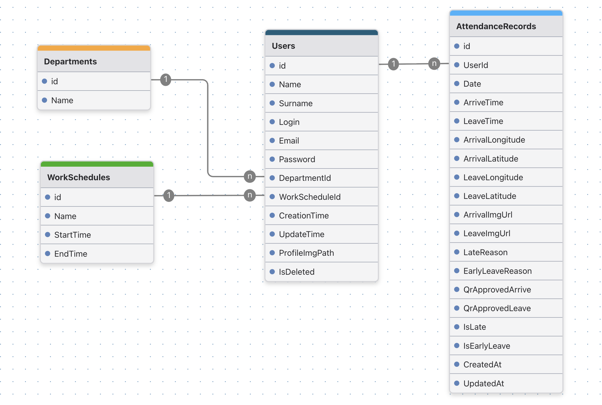

# ViTrack Backend

ViTrack is a modern employee attendance tracking system designed to simplify and replace traditional time-tracking hardware. Employees can easily check in and check out using their mobile devices by capturing a live photo and sharing their location. Managers can monitor attendance, analyze behavior, and access statistics in real time.

The system significantly improves operational efficiency and reduces manual tracking efforts by up to 85%.

---

## Frontend Repository

Backend works together with the frontend application:

👉 [https://github.com/Eljav04/ViTrack](https://github.com/Eljav04/ViTrack)

---

## Note

This system is already in production and actively used by a real company.

---

## Architecture Overview

The backend is built using a clean, modular architecture with clear separation of concerns.

* RESTful API architecture
* Layered (Onion) structure (API / Application / Infrastructure / Common)
* Scalable and maintainable design

---

## Tech Stack

* ASP.NET Core Web API
* Entity Framework Core
* MS SQL Server
* Serilog (logging)
* JWT Authentication
* Role-Based Access Control (RBAC)
* RESTful API design

---

## Key Features

* Secure authentication using JWT
* Role-based authorization (Admin / Employee)
* Backend-driven pagination
* Filtering support (server-side)
* Attendance tracking with geolocation and photo validation
* Statistics generation for employees and admins
* File handling system (image storage)
* Custom error handling and validation system

---

## Optimizations & Engineering Decisions

* Backend pagination to handle large datasets efficiently
* Optimized queries for attendance and statistics
* Minimal data duplication (normalized database design)
* Scalable repository pattern
* Clean separation between business logic and data access
* Efficient handling of large attendance history

---

## Project Structure Explanation

#### Api

* **Controllers** – API endpoints
* **DTOs** – data transfer objects
* **Errors** – centralized error handling
* **Extensions** – service and middleware extensions

#### Application

* **Interfaces** – contracts for services and repositories
* **Repositories** – business logic layer

#### Infrastructure

* **Data** – database context and configuration
* **Entities** – core database models

#### Common

* **Helpers** – utility classes (e.g., TimeHelper)
* **RequestFeatures** – pagination and query helpers
* **Services** – shared services
* **Statics** – constants and static values

---

## Additional Components

* Custom pagination helper system
* Time helper for timezone handling (Baku time)
* Custom error response formatter (frontend-friendly)
* File handling utilities (image upload & storage)
* Modular extension methods for cleaner configuration

---

## Database

* MS SQL Server
* Designed with normalization in mind
* Optimized for analytics and statistics queries
* Supports scalable attendance data growth

---

## Security

* JWT-based authentication
* Role-based access control
* Secure endpoints separation (/admin /employee)

---

## Notes

* The system is designed to scale for large datasets (hundreds of thousands of records)
* Backend logic is optimized to avoid unnecessary computations on each request
* Designed with future extensibility in mind (QR system, advanced analytics, etc.)

